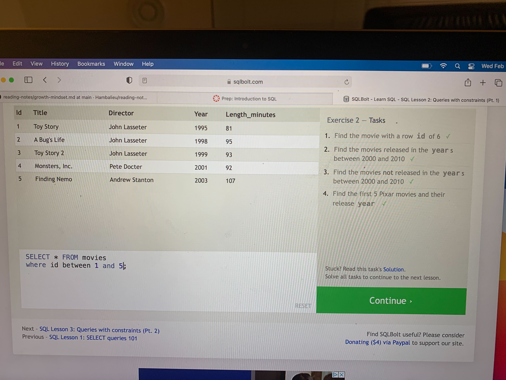
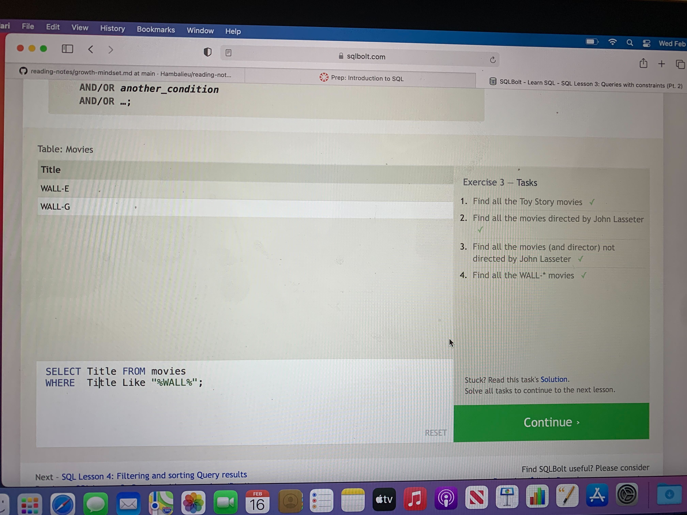
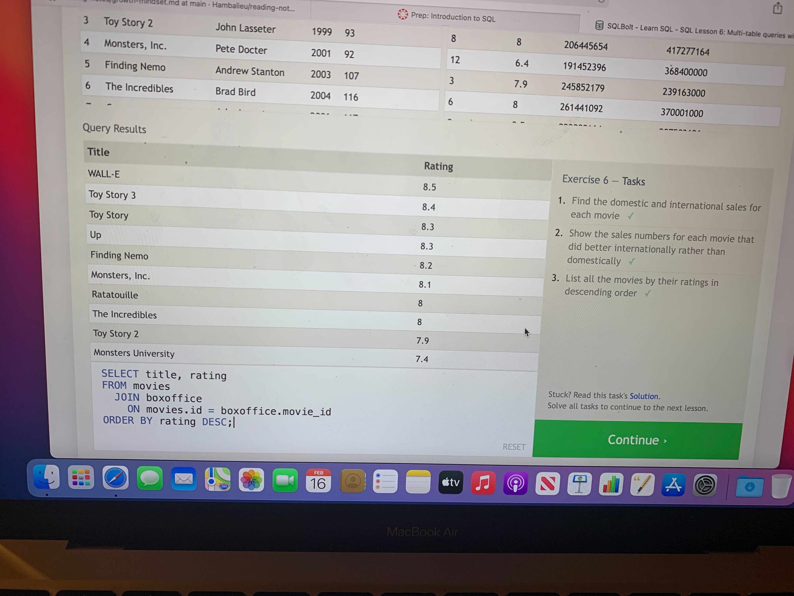
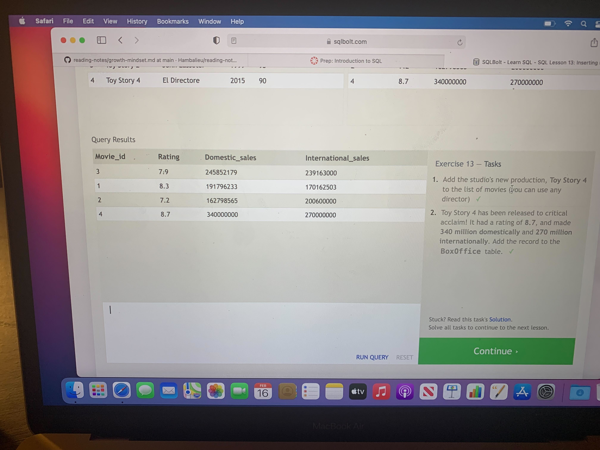
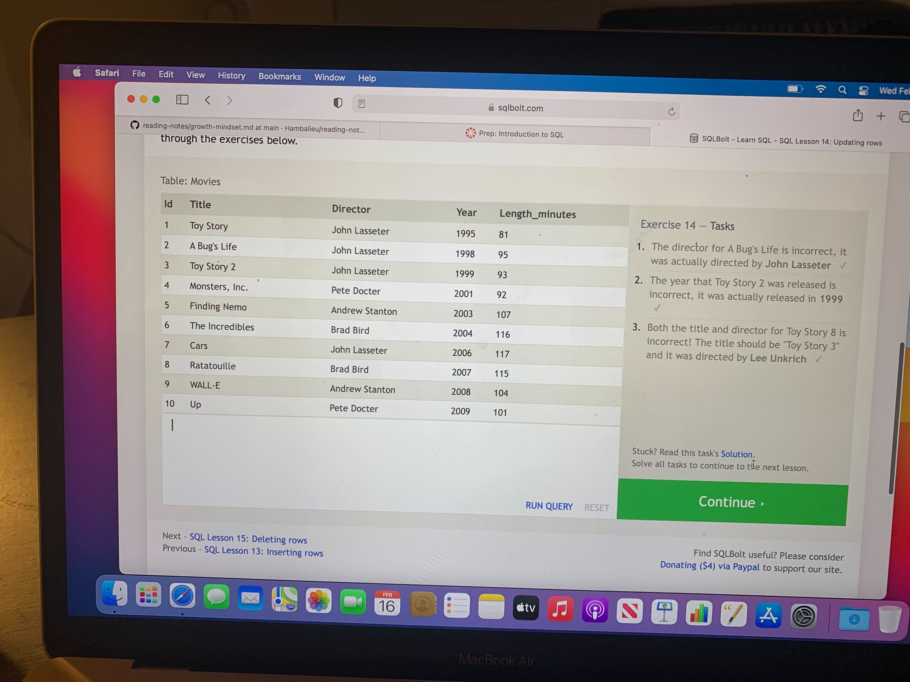
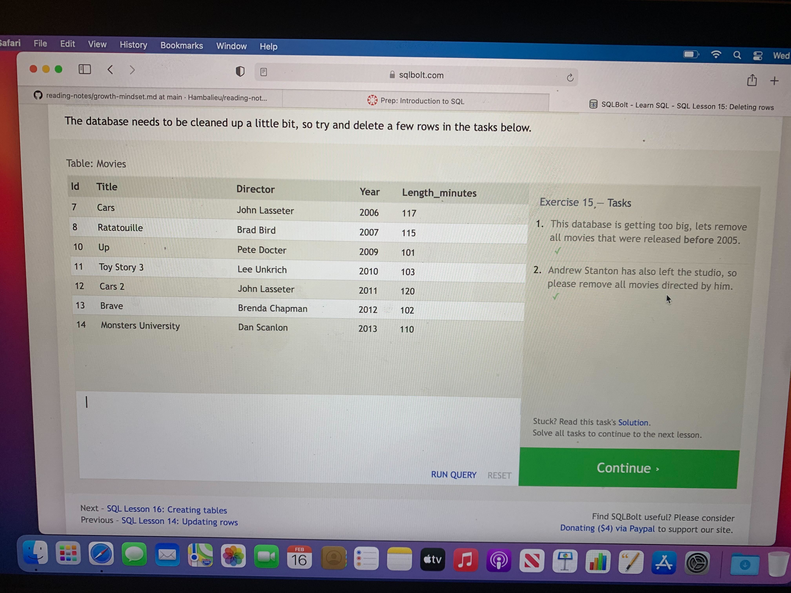
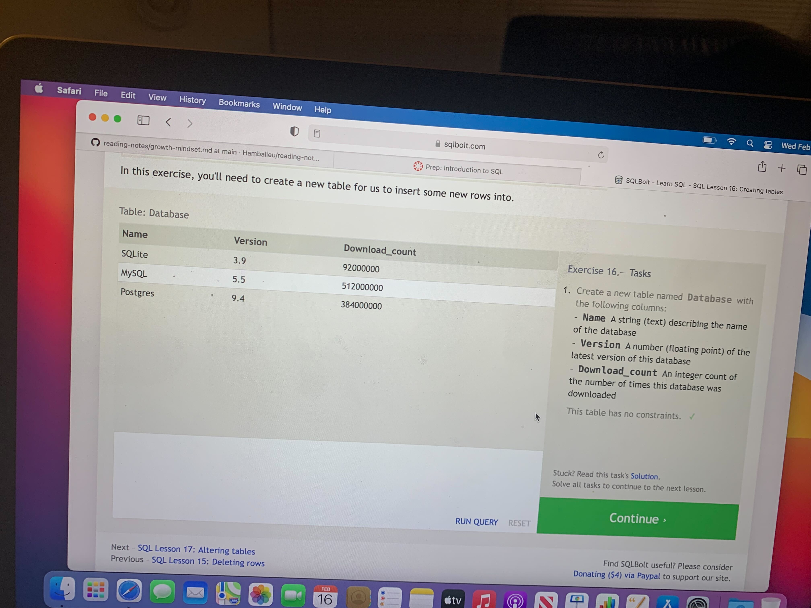
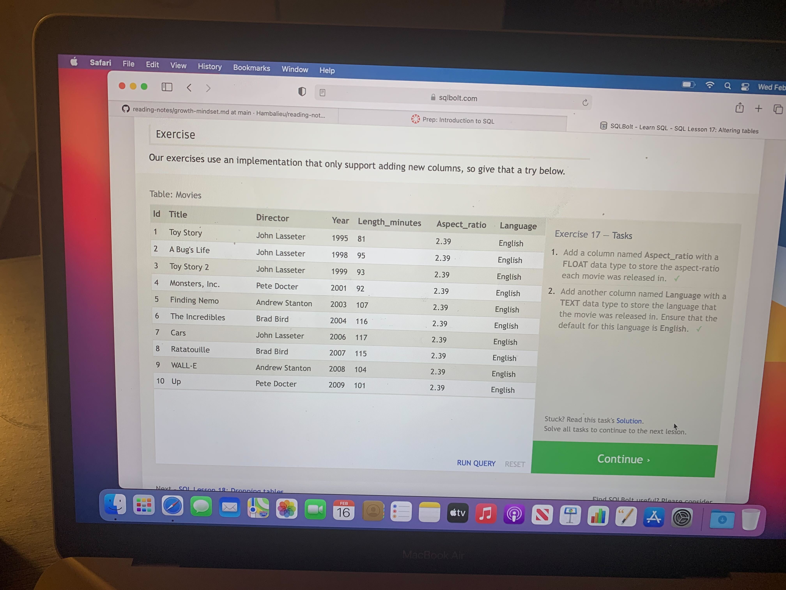
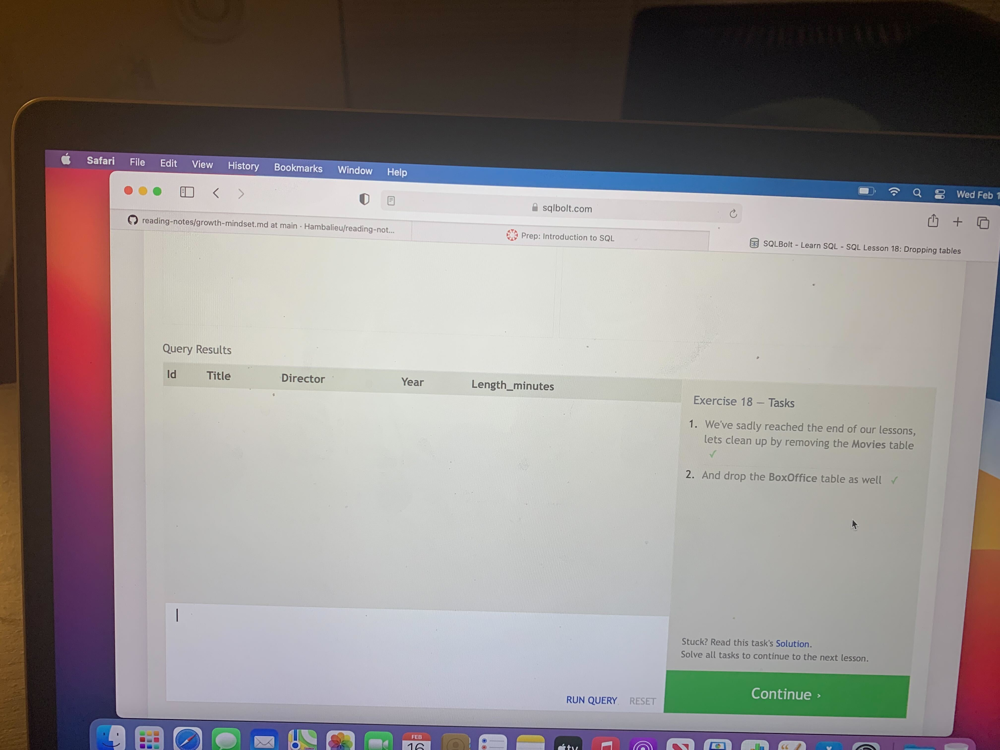
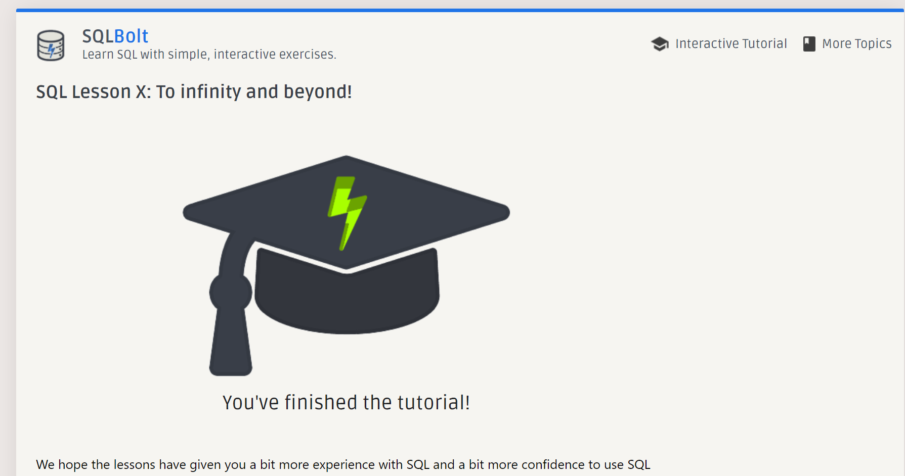

# SQL Practice

## What is SQL?

- SQL stands for **Structure Query Language**
- There are many popular SQL databases including MySQL, POSTgres  SQlite  Each of them can differ in additional features provided but all of them support the common SQL language standard.
- It is designed to allow both technical and non-technical users query, manipulate,and transform data from a relational database.
- Due to its simplicity ,SQL databases provide safe and scalable storage for millions of websites and mobile applications

## What is a relational Database?

- A relational database provides a common way to combine data.
- A realtional database represents a collection of related two dimensional tables.

## What can we do with SQL?

- SQL can execute queries against a database
- SQL can retrieve data from a database
- SQL can insert records in a database
- SQL can update records in a database
- SQL can delete records from a database
- SQL can create new databases
- SQL can create new tables in a database
- SQL can create stored procedures in a database
- SQL can create views in a database
- SQL can set permissions on tables, procedures, and views

## Task Completion:    

   

###  References/Citations

- [Learn-SQL](https://landing.chartio.com/download-learn-sql)

- [SQL tutorial](https://sqlbolt.com/)
